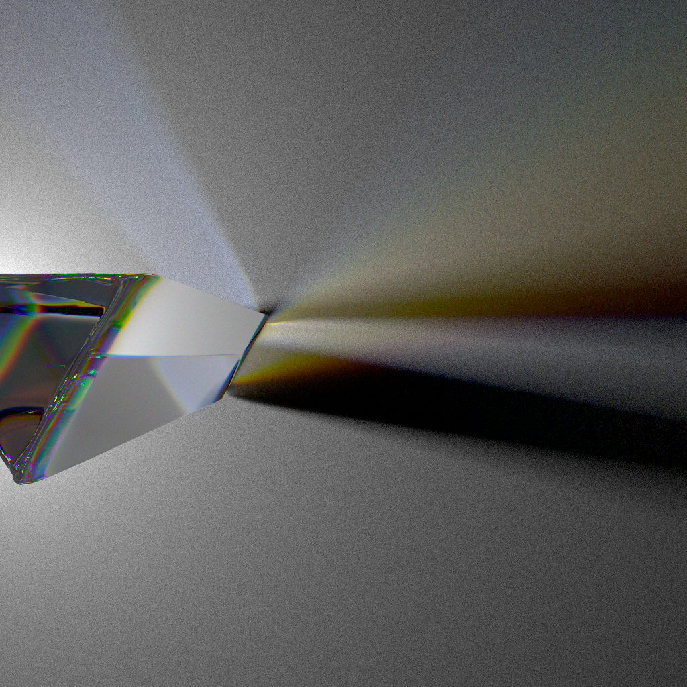
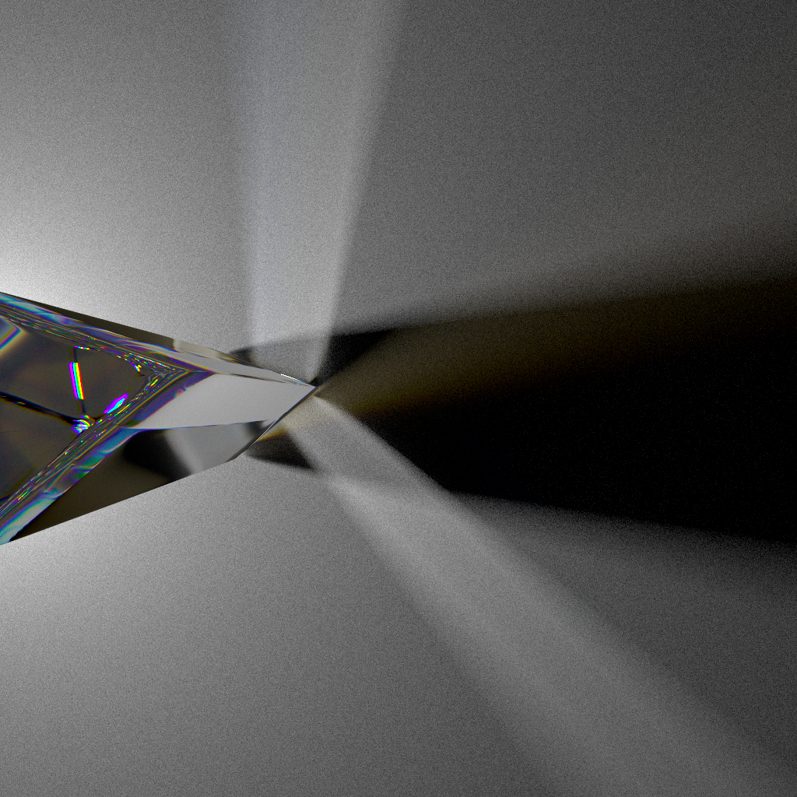
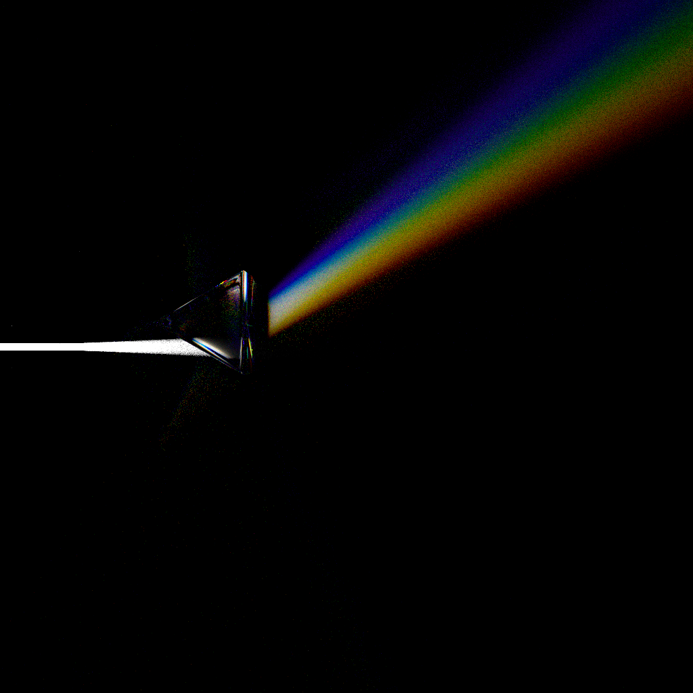
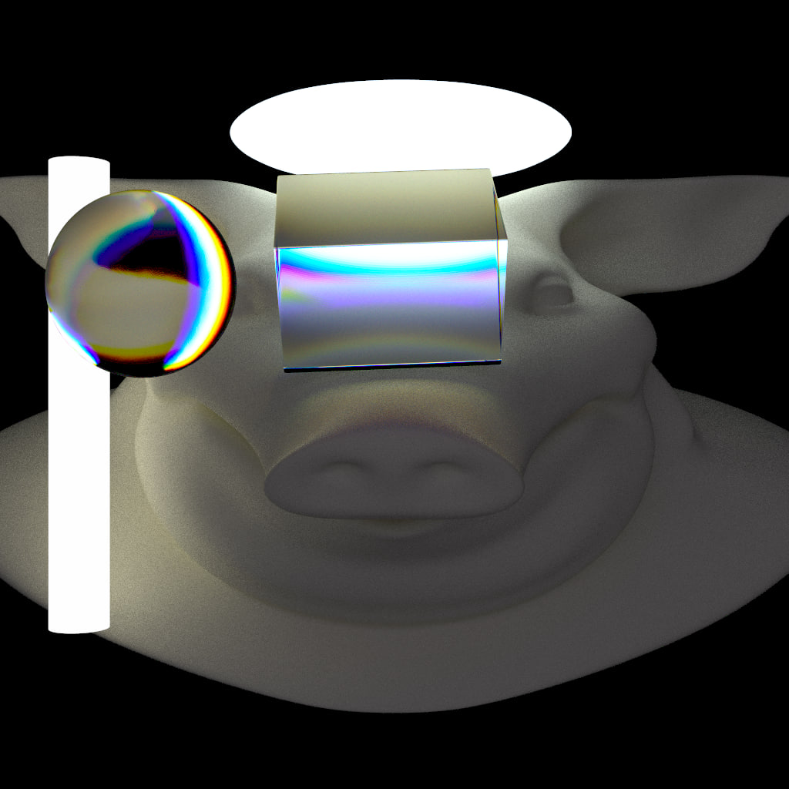
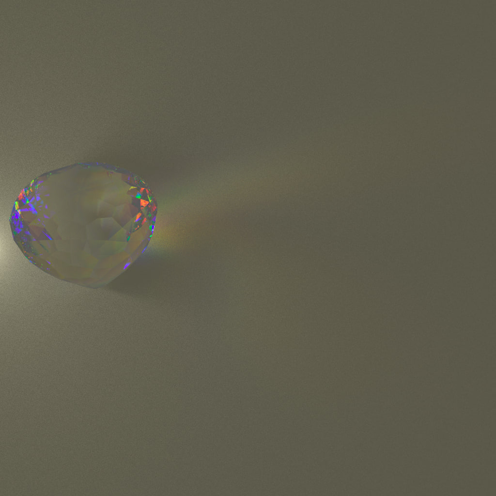

# Spectrum+pathtracer = Spectracer

A little out of curiosity test.

So it's just a brute-force backwards light path tracer, 
except it traces different light frequencies separately.

This is a test to get some "physically-correct" light decomposition
and rainbow effects

## Build

- windows users may just use [pre-built binaries](https://github.com/pedohorse/spectracer/releases)
- nix users may just do `nix run github:pedohorse/spectracer`, or build, then run, well, you know  
  (note, nixpkgs's zig hook builds with `ReleaseSafe`, not `ReleaseFast`)
- to build it the most boring way:
  - you need to install dependencies: `embree3`, `libspng` (maybe dev versions, depending on your package repo)
  - build script expects those libs to be installed to default system location (`/usr/include` and `/usr/lib`),
    you may change that in `build.zig` if you have something special going on.
  - `zig build -Doptimize=ReleaseFast`
  - use `zig-out/bin/spectracer`

## Usage

Check help with `spectracer -h`

Generally the idea is that you give it path to scene to render,
and output picture. Additionally some flags to control the quality can
be provided.

### Scene description

When you provide a "scene" to render - you need to provide
the path to a directory.

In that directory there may or may not be `scene.json` file

in both case you provide path the scene directory (not to any specific file in it),
so you just run smth like:

`spectracer path/to/scene output.png`

or with some flags (flags must be before the last argument):  
`spectracer path/to/scene -1 10 -2 6 -d 3 output.png`

#### Variant1: no scene.json

All files in the scene directory will be treated as `obj` files.

material and properties will be inferred from file name, structure is:

`<name>_<material>[_<mat_param>]*[_h].obj`

- `name` can be anything
- `material` can be one of
  - `lambert`
  - `light`
  - `glass`
  - `mirror`
- further parameters depend on material.
- optional `_h` in the end will disable tesselation for this object.  
  for better tesselation control use `scene.json` variant

For example:
- `foo_lambert_0.5_0.8_1.obj`  
  means that this object will have simple diffuse shading, with color (rgb)
  0.5, 0.8, 1.0
- `somename_light_5_5_5.obj`  
  means that this object will be a light, with intensity (rgb) 5, 5, 5
- `blablabla_glass_1.3_0.1.obj`  
  means this object is transparent and refractive (no reflections),
  1.3 here is base IoR, 0.1 is IoR shift. Light of the longest wavelength
  (red) will be refracted with IoR 1.3, light of the shortest wavelength
  (purple) will be refracted with IoR 1.3+0.1=1.4 (with all other wavelenghts
  having IoR linearly interpolated from 1.3 to 1.4)  
  This is where spectrum decomposition (rainbow) happens
- `bibabuba_mirror`  
  means this object is a perfect mirror.

#### Variant2: with scene.json

In this case, name of obj files do not matter, only `scene.json` file
is read.

This json file is expected to contain all information about scene objects
and materials. Example would be:

```json
{
  "objects": [
    {
      "file": "bg.obj",
      "mat": {
        "lambert": {
          "cr": 0.9,
          "cb": 0.9,
          "cg": 0.9
        }
      }
    },
    {
      "file": "tube1.obj",
      "mat": {
        "light": {
          "er": 4,
          "eb": 4,
          "eg": 4
        }
      }
    },
    {
      "file": "tube2.obj",
      "mat": {
        "glass": {
        }
      },
      "tesselation": 64
    }
  ]
}
```

All file paths are relative to `scene.json` directory

check `examples` dir for example scenes

## Example images
These images/animations were rendered in the process of making the renderer, so some have bugs, some don't have correct color transformation...

A prism  
  

Just one of first renders  


Somewhat of a diamond (not geometrically correct though)  


Some rotating prisms  


"Glass" pig head wiht light source inside  
(ior shift for high frequencies made extremely big to show off some rainbows)  


Parabolic mirror with glass tube moving around focal point  


A blob  

